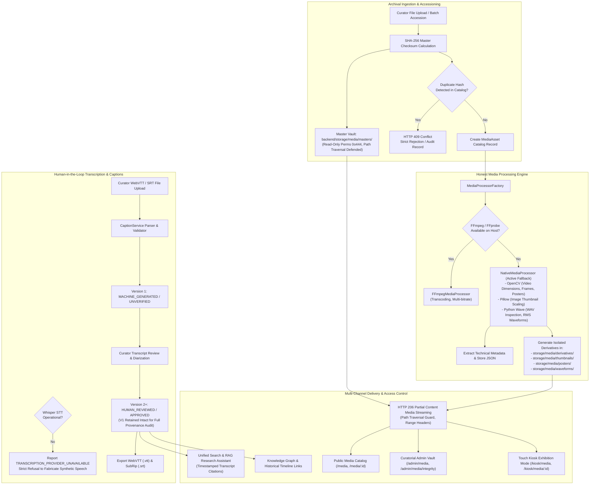

# Phase 8 Architecture: Archival Audio/Video Management & Media Intelligence

## 1. Architectural Overview

The **Phase 8 Audio/Video Archive and Media Intelligence Subsystem** extends the National Memorial and Heritage Archive platform with a production-grade, provenance-first audiovisual architecture. Designed specifically for historical sound recordings, documentary footage, and archival photographs, the subsystem balances strict digital preservation invariants with modern web delivery and multi-tier institutional accessibility.



---

## 2. Archival Invariants & Preservation Rules

### Rule 1: Master Immutability
All original files accessioned into the archive are saved into `backend/storage/media/masters/` under unique accession keys (`AMB-MED-<TYPE>-<ID>_<UUID>_<NAME>`). The storage directory permissions are set to read-only (`0o444`). The archival master is **never transcoded in-place, downsampled, overwritten, or modified**.

### Rule 2: Zero Historical Fabrication
The subsystem strictly forbids synthetic generation of historical facts:
- If a transcript is not available, the system displays `"NO_TRANSCRIPT_AVAILABLE"` or offers curatorial upload.
- If Whisper or FFmpeg is uninstalled on the host, the system dynamically reports `UNAVAILABLE` (`is_operational: false`). It **never mocks or synthesizes speech output**.
- Diarization tags strictly adhere to generic roles (`SPEAKER_1`, `SPEAKER_2`, `INTERVIEWER`, `UNKNOWN`, `NARRATOR`) unless human curators assign explicit historical identities verified by primary sources.

### Rule 3: Complete Auditability & Derivative Isolation
- All generated artifacts (thumbnails, video posters, normalized waveform JSON arrays, and caption tracks) are stored strictly outside `masters/` in designated isolated derivative directories.
- Every derivative maintains its own cryptographic SHA-256 hash, creation timestamp, and creator identity.
- Any curatorial edit to a transcript segment spawns a new version (`v2`, `v3`, etc.), while version 1 remains permanently preserved in the relational store for archival provenance audits.

---

## 3. Component Architecture

### A. Storage Layout
```
backend/storage/media/
├── masters/          # Immutable original master files (0o444)
├── derivatives/      # Transcoded access copies (MP4, MP3, WebM)
├── thumbnails/       # Responsive image thumbnails (JPEG, 320px)
├── posters/          # Video poster frame captures (JPEG, 1080p/720p)
├── waveforms/        # Pre-calculated 150-point RMS waveform JSON
├── transcripts/      # Plaintext & JSON transcript records
└── captions/         # WebVTT (.vtt) and SubRip (.srt) caption files
```

### B. Media Processing Pipeline
1. **Dynamic Provider Diagnostics (`provider_status.py`):**
   Runs non-destructive path audits for `ffmpeg`, `ffprobe`, and Python `whisper` imports. Exposes `/api/v1/media/diagnostics` for administrators and public UI badges.
2. **Native Python Processor (`NativeMediaProcessor`):**
   - **Video:** Utilizes OpenCV (`cv2`) for frame dimension extraction, aspect ratio calculation, framerate measurement, and accurate poster frame extraction at specified timestamps.
   - **Image:** Utilizes Pillow (`PIL`) for high-fidelity resizing, thumbnail generation, and metadata extraction.
   - **Audio:** Utilizes Python standard library `wave` and `struct` to extract sample rate, channels, bit depth, and compute normalized RMS amplitude peaks for waveform visualization.

### C. Caption & Transcription Subsystem
- **Standard WebVTT / SRT Parsing:** Tolerates multi-format millisecond timestamps (`00:00:01.000` and `00:00:01,000`), `<v Speaker>` tags, and curatorial header metadata.
- **Timing Collision Verification:** Guarantees non-overlapping intervals, monotonic timeline progression ($T_{start} < T_{end}$), and valid text contents.
- **Curatorial Review Workflow:** Segments can be edited, re-timed, and certified by archivists.

### D. Streaming Subsystem
- **HTTP 206 Partial Content:** Implements standard byte-range request processing (`bytes=start-end`), supporting seekable HTML5 `<video>` and `<audio>` scrubbing.
- **Path Traversal Defense:** Verifies canonical paths against allowed storage prefixes and validates integer database IDs.
- **Policy Enforcement:** Rejects download requests on `STREAM_ONLY` assets for non-admin visitors while permitting inline streaming.

### E. Integration with Phases 1–7
- **Unified Archival Search:** Searches across document full-text, entity graphs, metadata, and media transcript segments simultaneously.
- **RAG Research Assistant:** Retrieves verified transcript segments matching research queries and formats verifiable citation links (`[Speech Title @ 00:01:25]`).
- **Knowledge Graph & Timeline:** Historical entities and timeline events link directly to media assets via `media_asset_id` foreign keys.
