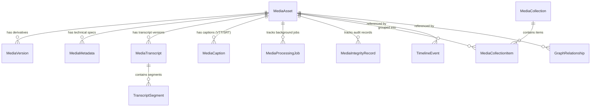

# Phase 8 Data Model: Audiovisual Catalog & Media Intelligence Schema

## 1. Relational Database Models & Tables

Phase 8 introduces 10 dedicated relational models in SQLAlchemy and Alembic, preserving complete backward compatibility with Phase 1–7 models (such as `Document`, `Chunk`, `Entity`, `TimelineEvent`, and legacy `MediaItem`).

---

## 2. Table Specifications

### 2.1 `media_assets`
Represents the primary archival master catalog record.
- `id` (INTEGER, PK): Unique internal database identifier.
- `archive_id` (VARCHAR(100), UNIQUE, INDEX): Institutional accession code (e.g. `AMB-MED-AUD-1949-001`).
- `title` (VARCHAR(500), INDEX): Title of the recording or visual artifact.
- `subtitle` (VARCHAR(500), NULLABLE): Contextual subtitle or event name.
- `description` (TEXT, NULLABLE): Archival description and historical provenance notes.
- `media_type` (VARCHAR(50), INDEX): `AUDIO`, `VIDEO`, `IMAGE`, `PHOTOGRAPH`, `OTHER`.
- `format` (VARCHAR(50)): File format extension (`WAV`, `MP3`, `MP4`, `PNG`, etc.).
- `mime_type` (VARCHAR(100)): Standard IANA MIME type (`audio/wav`, `video/mp4`, etc.).
- `duration` (FLOAT, NULLABLE): Runtime in seconds.
- `file_size` (BIGINT): File size in bytes.
- `checksum_sha256` (VARCHAR(64), INDEX): Cryptographic SHA-256 fingerprint of the original master.
- `source_name` (VARCHAR(255)): Institutional source (e.g. `Dr. Ambedkar National Memorial`).
- `creator` (VARCHAR(255), NULLABLE): Recording engineer, speaker, or photographer.
- `date` (VARCHAR(50), NULLABLE): Historical creation date (`YYYY-MM-DD`, `YYYY`, etc.).
- `date_precision` (VARCHAR(30)): `EXACT_DAY`, `MONTH`, `YEAR`, `DECADE`, `APPROXIMATE`, `UNKNOWN`.
- `language` (VARCHAR(50)): Primary language of audio/speech.
- `rights` (VARCHAR(255)): Rights statement (e.g. `Public Domain / Institutional Heritage Access`).
- `access_level` (VARCHAR(20), INDEX): `PUBLIC`, `RESEARCH_ONLY`, `RESTRICTED`, `PRIVATE`.
- `download_policy` (VARCHAR(30), INDEX): `STREAM_ONLY`, `DOWNLOAD_ALLOWED`, `ADMIN_ONLY`.
- `verification_status` (VARCHAR(30), INDEX): `UNVERIFIED`, `PENDING_REVIEW`, `VERIFIED`, `REJECTED`.
- `archival_status` (VARCHAR(30), INDEX): `MASTER_PRESERVED`, `DERIVATIVES_GENERATED`, `QUARANTINED`, `CORRUPTED`.
- `storage_path` (VARCHAR(500)): Absolute/relative path to immutable master in `masters/`.
- `thumbnail_path` (VARCHAR(500), NULLABLE): Path to 320px thumbnail derivative.
- `poster_path` (VARCHAR(500), NULLABLE): Path to 1080p/720p video poster frame.
- `waveform_data_path` (VARCHAR(500), NULLABLE): Path to precomputed 150-point waveform JSON.
- `created_at` / `updated_at` (DATETIME): Audit timestamps.

### 2.2 `media_versions`
Tracks all derived files and preservation copies without modifying the master.
- `id` (INTEGER, PK)
- `media_id` (INTEGER, FK -> `media_assets.id` ON DELETE CASCADE)
- `version_number` (INTEGER): Monotonically increasing version counter.
- `derivative_type` (VARCHAR(50)): `ORIGINAL_MASTER`, `PRESERVATION_COPY`, `STREAMING_COPY`, `WEB_PREVIEW`, `AUDIO_EXTRACT`, `THUMBNAIL`, `POSTER_FRAME`, `WAVEFORM`.
- `file_path` (VARCHAR(500)): Path to derivative file (strictly outside `masters/`).
- `mime_type` (VARCHAR(100)): Derivative MIME type.
- `resolution` (VARCHAR(50), NULLABLE): Video or image dimensions (`1920x1080`, `320x180`).
- `file_size` (BIGINT): Derivative size in bytes.
- `checksum_sha256` (VARCHAR(64)): Checksum of derivative.
- `created_by` (INTEGER, FK -> `users.id`, NULLABLE)

### 2.3 `media_technical_metadata`
Stores raw technical inspection reports from inspection engines.
- `id` (INTEGER, PK)
- `media_id` (INTEGER, FK -> `media_assets.id` ON DELETE CASCADE)
- `metadata_category` (VARCHAR(50)): `TECHNICAL_OPENCV`, `TECHNICAL_PILLOW`, `TECHNICAL_WAVE`, `TECHNICAL_FFPROBE`.
- `raw_json` (TEXT): Complete JSON payload of inspection metrics.

### 2.4 `media_transcripts` & `transcript_segments`
Maintains versioned transcript records and individual timestamped utterance chunks.
- `media_transcripts`:
  - `version` (INTEGER): Version number (`1` for machine/imported, `2+` for curator corrections).
  - `source_type` (VARCHAR(50)): `MACHINE_TRANSCRIPT`, `IMPORTED_TRANSCRIPT`, `CURATOR_CORRECTED`, `HUMAN_TRANSCRIBED`.
  - `status` (VARCHAR(30)): `MACHINE_GENERATED`, `PENDING_REVIEW`, `HUMAN_REVIEWED`, `APPROVED`, `REJECTED`.
  - `model` (VARCHAR(100)): AI model ID (e.g. `whisper-base`) or `manual-curator`.
- `transcript_segments`:
  - `start_time` / `end_time` (FLOAT): Offsets in seconds (e.g. `12.5`, `18.2`).
  - `start_timestamp_str` / `end_timestamp_str` (VARCHAR(20)): Formatted timestamp (`00:00:12.500`).
  - `text` (TEXT): Spoken transcript text.
  - `speaker_label` (VARCHAR(100)): `SPEAKER_1`, `SPEAKER_2`, `INTERVIEWER`, `UNKNOWN`, `NARRATOR`.
  - `confidence` (FLOAT): ASR confidence score ($0.0 - 1.0$) or $1.0$ for curator verified.

### 2.5 `media_captions`
Stores timed caption tracks for HTML5 `<track>` video/audio players.
- `format` (VARCHAR(20)): `WEBVTT` or `SRT`.
- `language` (VARCHAR(50)): ISO language code (`en`, `hi`, `mr`, `ta`).
- `caption_text` (TEXT): Pre-formatted standard WebVTT or SubRip content.
- `verification_status` (VARCHAR(30)): `PENDING_REVIEW`, `APPROVED`.

### 2.6 `media_integrity_records`
Audit trail of SHA-256 integrity verifications.
- `media_id` (INTEGER, FK -> `media_assets.id`)
- `media_version_id` (INTEGER, FK -> `media_versions.id`, NULLABLE)
- `expected_sha256` (VARCHAR(64))
- `actual_sha256` (VARCHAR(64))
- `status` (VARCHAR(30)): `INTEGRITY_VERIFIED`, `INTEGRITY_FAILED`, `FILE_MISSING`.
- `verified_at` (DATETIME)
- `details` (TEXT)

---

## 3. Backward Compatibility with Phases 1–7

1. **`TimelineEvent` Integration:** Added `media_asset_id = Column(Integer, ForeignKey("media_assets.id", ondelete="SET NULL"), nullable=True)`. Timeline events can display attached archival audio recordings or historical film reels inline.
2. **`GraphRelationship` Integration:** Added `media_asset_id = Column(Integer, ForeignKey("media_assets.id", ondelete="SET NULL"), nullable=True)`. Knowledge graph edges can cite archival media recordings as primary evidentiary proof.
3. **Legacy `MediaItem` Preservation:** Retained unchanged to support any existing legacy media endpoints without regression.
