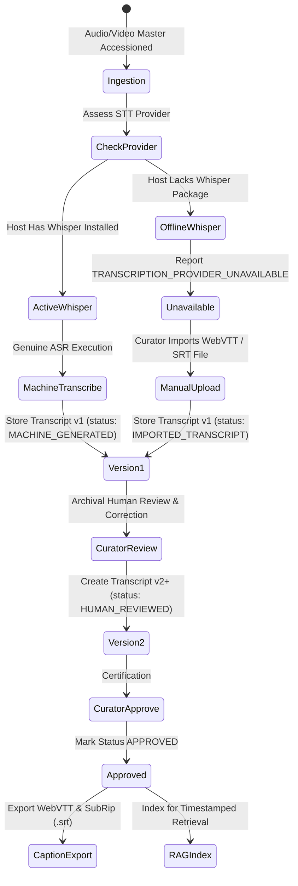

# Phase 8 Speech Intelligence: Transcription, Captions & Diarization Pipeline

## 1. Transcription Provider Architecture

Speech-to-text processing for archival recordings is managed by a modular provider abstraction designed to prioritize evidentiary fidelity over automated convenience.

---

## 2. Strict Refusal to Fabricate Synthetic Speech

The `WhisperTranscriptionProvider` strictly queries `is_whisper_installed()`. When Whisper is absent:
1. `get_status()` returns `status: "TRANSCRIPTION_PROVIDER_UNAVAILABLE"`, `is_operational: false`.
2. Calling `transcribe()` raises `TranscriptionUnavailableError`:
   > *"Whisper transcription provider is UNAVAILABLE. Whisper is not installed on this system. The archive strictly refuses to fabricate synthetic transcripts."*
3. The platform **never returns canned, demo, or hallucinated text** for archival recordings.

---

## 3. Caption Parsing & Validation (`CaptionService`)

The `CaptionService` implements two-way conversion between timestamped segment objects and industry-standard subtitle formats:

### Supported Caption Standards
- **WebVTT (`.vtt`):** Includes standard `WEBVTT` header, metadata cues, cue timings (`00:01:23.450 --> 00:01:28.900`), and optional speaker tags (`<v SPEAKER_1>`).
- **SubRip (`.srt`):** Sequential numeric cues, comma millisecond delimiters (`00:01:23,450 --> 00:01:28,900`), and speaker prefix notation (`SPEAKER_1: Text`).

### Timing Validation Rules
Every segment array undergoes rigorous mathematical validation before insertion into the database:
1. **Monotonicity:** $T_{\text{start}} < T_{\text{end}}$. Negative durations or zero-length cues are rejected.
2. **Sequential Ordering:** For any segment $i > 0$, $T_{\text{start}}^{(i)} \ge T_{\text{start}}^{(i-1)}$.
3. **Collision / Overlap Defense:** Flags warnings or errors if segments overlap inappropriately.
4. **Text Integrity:** Strips HTML injection vectors, scripts, and ensures non-empty text payloads.

---

## 4. Speaker Diarization Standards

To uphold historical accuracy and prevent defamatory or unsubstantiated identity attribution:
- Automated machine transcription outputs use standard generic diarization identifiers:
  - `SPEAKER_1`
  - `SPEAKER_2`
  - `INTERVIEWER`
  - `NARRATOR`
  - `UNKNOWN`
- Historical identities (e.g. *"Dr. B.R. Ambedkar"*, *"Pt. Jawaharlal Nehru"*) may **only** be assigned by an archivist or certified curator through curatorial review, backed by recorded provenance documentation.

---

## 5. Curatorial Review, Versioning & Audit Trail

The platform guarantees that machine-generated transcripts never masquerade as verified historical transcripts:
- Initial ingestion creates **Version 1** marked with `status = "MACHINE_GENERATED"` or `"PENDING_REVIEW"`.
- When an archivist modifies text, timings, or speaker labels via `/api/v1/media/{id}/transcripts/{tid}/review`:
  - **Version 1 is NEVER updated in-place**. It remains preserved with its original timestamps and model metadata.
  - A new **Version 2** is created with `status = "HUMAN_REVIEWED"`, referencing the reviewer's user ID and timestamp.
  - Upon final curatorial sign-off, `status` progresses to `"APPROVED"`, generating synchronized `.vtt` and `.srt` caption tracks.
