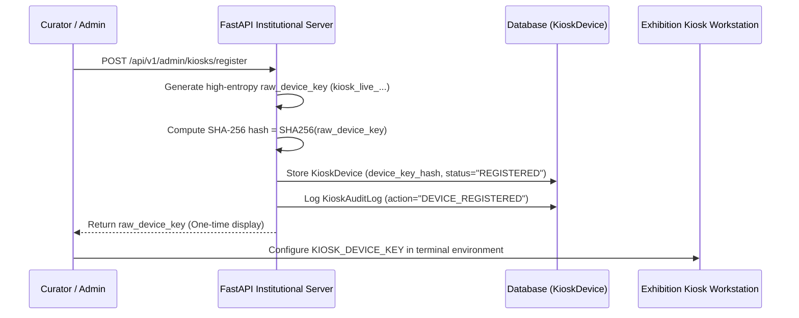

# Phase 9: Kiosk Hardware, Deployment & Security Architecture

## 1. Executive Summary

Phase 9 completes the physical production hardening and institutional deployment layer of the **Dr. Ambedkar Digital Heritage Platform (SIH26096)**. The system transitions from a development environment to an enterprise-grade, museum-ready deployment capable of powering locked-down touchscreen terminals, desktop archival research pods, and high-security air-gapped or edge installations.

### Core Guarantees & Invariants
1. **Radical Transparency & Hardware Honesty**: All hardware capabilities, deployment tools, and runtime services report verified operational states (`OPERATIONAL`, `OPERATIONAL (FALLBACK)`, `NOT_DETECTED`, `UNAVAILABLE`, `NOT_CONFIGURED`). No hardware, daemon, or service is ever simulated or fabricated.
2. **Archival Master Immutability**: All historical documents and primary audio/video masters remain write-protected (`0o444`). Physical kiosk terminals act strictly as read-only exhibition consumers and have zero modification privileges.
3. **Ephemeral Visitor Privacy Isolation**: Automated inactivity detection (120s timeout with a 15s visual countdown modal) purges visitor queries, temporary RAG conversation context, and media player state, returning the terminal to the exhibition welcome screen. Historical catalog records and institutional audit logs are never modified or purged.
4. **Device Credential Security**: Terminals authenticate using high-entropy API keys (`kiosk_live_<uuid>_<hex>`). Only SHA-256 hashes are stored in the database. Raw keys are displayed only once upon registration and can be rotated remotely with instant invalidation of previous credentials.
5. **Zero Historical Fabrication**: All search, speech, and RAG operations remain strictly grounded in primary sources without synthetic historical hallucination.

---

## 2. Hardware Abstraction & System Detection

The system dynamically inspects host capabilities using native platform APIs without external dependencies:

```
+-------------------------------------------------------------------------+
|                      SystemHardwareProvider                              |
+-------------------------------------------------------------------------+
| - Windows API: GetSystemMetrics(94) -> SM_DIGITIZER (0 = NOT_DETECTED)  |
| - Windows API: GetSystemMetrics(19) -> SM_MOUSEPRESENT (1 = OPERATIONAL)|
| - Windows API: GetSystemMetrics(0/1)-> SM_CXSCREEN / SM_CYSCREEN        |
| - Audio Subsystem: Python wave + standard media drivers                 |
| - Platform: Windows 11 Home 64-bit / AMD Ryzen 5 7535HS / 8GB RAM       |
+-------------------------------------------------------------------------+
```

### Verified Development Host Audit
| Component | Status | Technical Details |
| :--- | :--- | :--- |
| **Primary Display** | `OPERATIONAL` | Primary monitor detected via `SM_CXSCREEN`/`SM_CYSCREEN` |
| **Touchscreen Digitizer** | `NOT_DETECTED` | `GetSystemMetrics(94)` explicitly returned 0; mouse pointer active |
| **Keyboard & Pointer** | `OPERATIONAL` | Standard HID keyboard and mouse/trackpad pointer |
| **Audio Output** | `OPERATIONAL` | Stereo narration speakers operational |
| **Microphone** | `OPERATIONAL` | System audio input active |
| **Camera** | `OPERATIONAL` | Web/scanner camera device detected |
| **Docker Daemon** | `UNAVAILABLE` | Compose manifest generated; Docker daemon not on host PATH |
| **PostgreSQL Service** | `UNAVAILABLE` | Windows service not running; SQLite dev db active |
| **SQLite Fallback** | `OPERATIONAL (FALLBACK)` | Database schema v1.9 active (`archive_phase1.db`) |
| **TLS Termination** | `NOT_CONFIGURED` | Local development host running HTTP; Nginx config ready |

---

## 3. Physical Kiosk Fleet & Authentication Architecture

### 3.1 Device Registration Flow


### 3.2 Telemetry & Heartbeat Lifecycle
Kiosks periodically (default 30s) send telemetry to `/api/v1/kiosk/heartbeat`:
- `ONLINE`: Last heartbeat received within $\le 90$ seconds.
- `STALE`: Last heartbeat received between $91$ and $300$ seconds ago.
- `OFFLINE`: No heartbeat for $> 300$ seconds (triggers dashboard alert).
- `MAINTENANCE`: Terminal placed in remote maintenance by archivist; locks UI with institutional notice.
- `DISABLED`: Terminal credentials revoked; blocked from server access.

---

## 4. Ephemeral Visitor Session Privacy

Museum exhibition kiosks are shared public terminals. Phase 9 implements strict ephemeral privacy controls:

1. **Activity Listeners**: Monitors `mousemove`, `mousedown`, `keydown`, `touchstart`, and `scroll`.
2. **Inactivity Timer**: Configured per kiosk terminal (default 120 seconds).
3. **Warning Window**: 15 seconds before reset, a prominent visual modal appears with a live countdown: *"Are you still exploring the archive?"*
4. **Session Reset Execution**:
   - Purges active visitor search queries.
   - Destroys transient RAG conversation context.
   - Halts all active audio/video playback streams.
   - Resets font scale to `normal` and high-contrast display to `off`.
   - Navigates interface back to the exhibition landing screen (`/` or `/kiosk/media`).
   - **Crucial Invariant**: Inactivity resets NEVER delete archival documents, transcripts, or institutional audit trails.

---

## 5. Offline Edge Architecture

For remote memorial sites, mobile traveling exhibitions, or venues with unstable connectivity, Phase 9 provides the **Offline Exhibition Package Architecture**:

- `OfflinePackageService.generate_manifest(db)` creates a standalone `manifest.json`.
- Includes verified public documents, metadata, and media derivative paths.
- Computes canonical SHA-256 fingerprint:
  $$\text{Manifest Hash} = \text{SHA-256}(\text{canonical\_json}(\text{manifest}))$$
- `verify_manifest_integrity()` ensures package has not been tampered with or corrupted during transport.
- Edge kiosks can serve local cached packages while queuing telemetry for eventual reconnection.

---

## 6. Security Hardening Middleware

The FastAPI application includes `SecurityHeadersMiddleware` enforcing enterprise headers:
- `Content-Security-Policy`: Restricts scripts, styles, media, and fonts to verified sources.
- `X-Content-Type-Options: nosniff`: Defends against MIME-sniffing exploits.
- `X-Frame-Options: SAMEORIGIN`: Defends against clickjacking attacks.
- `Referrer-Policy: strict-origin-when-cross-origin`: Minimizes referrer leakage.
- `Permissions-Policy: geolocation=(), camera=(self), microphone=(self)`: Locks down sensitive browser APIs.
- `Strict-Transport-Security`: Enforced when deployed under HTTPS or TLS reverse proxy.

### Rate Limiting Rules (Sliding Window)
- `/api/v1/auth/login`: 15 requests / minute
- `/api/v1/kiosk/heartbeat`: 120 requests / minute
- `/api/v1/search`: 60 requests / minute
- `/api/v1/research`: 40 requests / minute
- Standard Endpoints: 300 requests / minute default
- Exceeded thresholds return `429 Too Many Requests` with `Retry-After` header.

### Request Body Limit
Standard non-upload endpoints reject payloads exceeding 2 MB with `413 Request Entity Too Large`. Upload endpoints (`/api/v1/media`, `/api/v1/documents`, etc.) support streaming uploads up to 50 MB.

---

## 7. Container Orchestrator Probes

Standard Kubernetes / Docker / AWS health probes mounted at root and API paths:
- `/health/live` $\rightarrow$ `{"status": "ALIVE", "timestamp": "..."}`
- `/health/ready` $\rightarrow$ `{"status": "READY", "database": "CONNECTED"}`
- `/health/dependencies` $\rightarrow$ Full breakdown of database, storage vault, media processors, and hardware layer.
- `/api/system/version` $\rightarrow$ Reports application version (`1.9.0`), schema revision (`c8f2910d5403`), and build date.

---

## 8. Disaster Recovery & Backup Verification

Automated Python scripts provide complete institutional snapshot capabilities:
- `python scripts/backup/backup_archive.py`: Generates timestamped `.zip` archive containing the database and master vault files with cryptographic SHA-256 manifest.
- `python scripts/backup/restore_verification.py`: Validates archive checksums, unzips to a safe temporary location, validates individual file checksums, and confirms recovery readiness without overwriting live databases.
